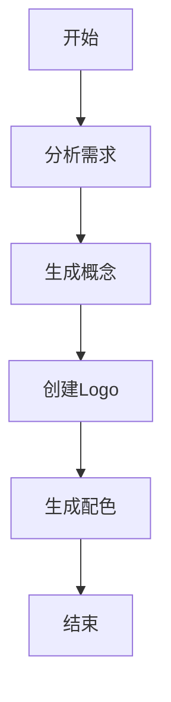

### 任务规划中间件

我已经实现了任务规划中间件，完成了以下功能：

#### 1. 任务规划功能

实现了根据用户输入的brief规划任务的功能，支持不同类型的任务：
Logo设计任务：包含分析需求、生成概念、创建Logo、生成配色等步骤
代码生成任务：包含分析需求、设计架构、生成代码、测试代码等步骤
默认任务：简单的处理流程

#### 任务图示例

#### 2. 任务图生成

根据规划的任务节点，生成完整的任务图：
定义了任务节点类型：开始、结束、处理、决策、并行等
根据依赖关系生成边，形成有向无环图
支持复杂的任务依赖关系

#### 3. 执行计划生成

基于任务图，生成可执行的任务执行计划：
使用拓扑排序确定任务执行顺序
检测并标记可并行执行的任务组
为每个任务步骤分配估计执行时间

#### 4. 可视化支持

提供了任务图的可视化表示功能：
生成Mermaid图表代码
根据节点类型使用不同的图形表示
清晰展示任务流程和依赖关系

#### 5. Koa中间件集成

将任务规划功能集成到Koa中间件中：
在API请求处理过程中自动进行任务规划
将规划结果添加到请求上下文中
支持任务检查点记录
适当的错误处理
这个任务规划中间件可以帮助系统更好地组织和执行复杂的AI任务，提高任务执行的效率和可靠性。