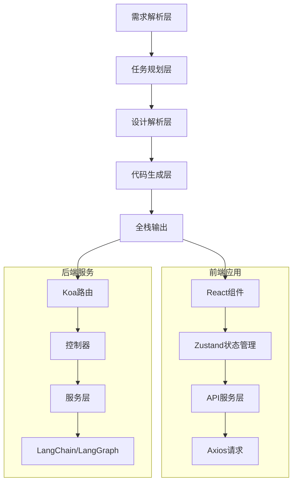
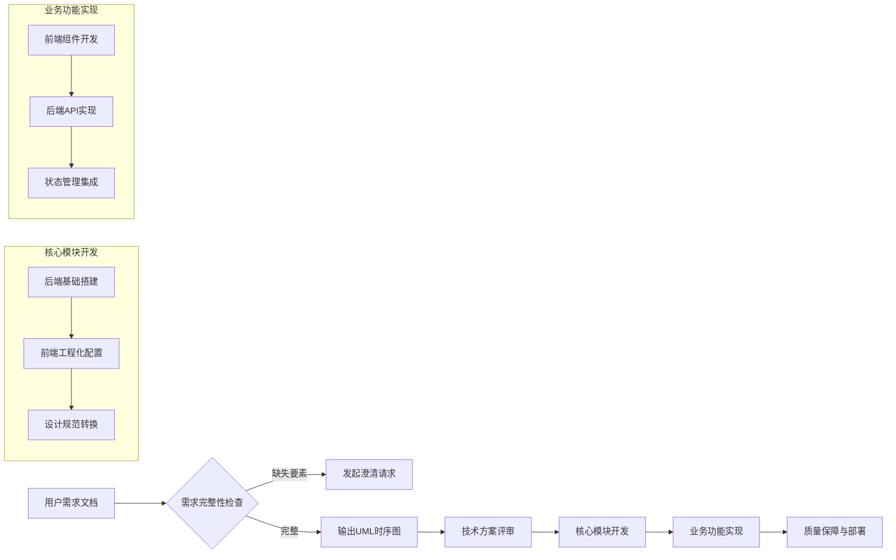
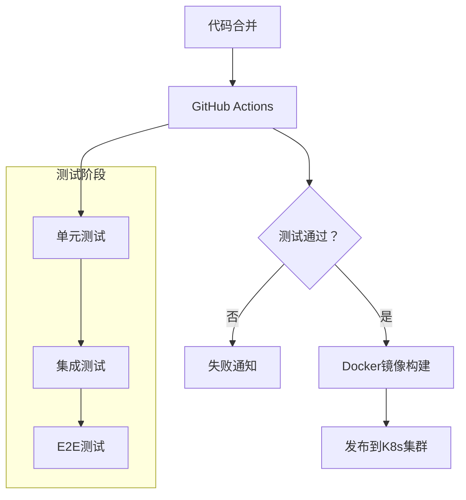

# 系统架构

## 系统整体架构

React代码自动生成系统采用分层架构设计，从需求输入到代码生成形成完整闭环。系统分为以下几个核心层次：

1. **需求解析层**：负责理解和结构化用户的自然语言需求
2. **任务规划层**：将需求转化为可执行的任务计划，识别依赖关系
3. **设计解析层**：从Figma等设计工具中提取UI规范和组件结构
4. **代码生成层**：基于前述信息生成前后端代码
5. **全栈输出层**：整合生成的代码，提供完整的应用解决方案



## 前端架构

前端采用React18+TypeScript5+Vite技术栈，结构清晰，模块化程度高。

### 核心模块

1. **组件层**
   - 页面组件：实现具体业务页面
   - 通用组件：如AutoFigmaComponent，可直接从Figma设计转换为React组件
   - 容器组件：如TaskManager，负责状态管理和业务逻辑

2. **状态管理**
   - 基于Zustand实现轻量级状态管理
   - 支持异步action和状态持久化
   - 各模块状态相互独立，避免全局状态污染

3. **服务层**
   - API服务：封装Axios请求，统一处理认证和错误
   - 设计解析服务：处理Figma API返回的设计规范

4. **工具层**
   - 类型定义：使用TypeScript确保类型安全
   - 工具函数：提供通用功能支持

### 目录结构

```
app-gene/
├── src/
│   ├── components/        # 组件目录
│   ├── services/          # 服务层
│   ├── stores/            # 状态管理
│   ├── utils/             # 工具函数
│   └── types/             # 类型定义
├── vite.config.ts         # Vite配置
└── tsconfig.json          # TypeScript配置
```

## 后端架构

后端采用Node.js+Koa+TypeScript技术栈，遵循MVC架构模式。

### 核心模块

1. **路由层**
   - 定义API端点
   - 处理请求参数验证
   - 实现路由级中间件

2. **控制器层**
   - 处理业务逻辑
   - 调用服务层功能
   - 格式化响应数据

3. **服务层**
   - 实现核心业务功能
   - 集成LangChain进行需求解析
   - 集成LangGraph构建任务DAG

4. **中间件层**
   - 认证中间件：基于JWT实现用户认证
   - 权限中间件：控制资源访问权限
   - 错误处理中间件：统一处理异常

### 目录结构

```
server-gene/
├── src/
│   ├── controllers/       # 控制器
│   ├── middlewares/       # 中间件
│   ├── routes/            # 路由定义
│   ├── services/          # 服务层
│   └── utils/             # 工具函数
├── tsconfig.json          # TypeScript配置
└── .env                   # 环境变量
```

## 数据流

系统数据流遵循单向流动原则，确保状态变更可预测、可追踪。

1. **前端数据流**
   - 用户交互触发Action
   - Action调用API服务或直接修改状态
   - 状态变更触发UI重新渲染

2. **后端数据流**
   - 请求通过路由进入系统
   - 中间件处理通用逻辑（认证、日志等）
   - 控制器处理业务逻辑并调用服务
   - 服务执行核心功能并返回结果
   - 控制器格式化响应并返回客户端

## 任务流程

系统实现了完整的需求到代码的转换流程：



## 部署架构

系统采用容器化部署方案，支持CI/CD自动化流程：



### 部署流程

1. 开发人员提交代码到主分支
2. GitHub Actions自动触发CI流程
3. 运行测试套件（单元测试、集成测试、E2E测试）
4. 测试通过后构建Docker镜像
5. 将镜像推送到容器仓库
6. 通过Kubernetes部署到目标环境

### 环境配置

- 开发环境：本地开发服务器
- 测试环境：独立的测试集群
- 生产环境：高可用K8s集群

## 监控与日志

系统实现了全面的监控和日志记录机制：

1. **应用监控**
   - 性能指标：响应时间、吞吐量、错误率
   - 资源使用：CPU、内存、磁盘IO
   - 用户行为：页面访问、功能使用频率

2. **日志管理**
   - 结构化日志：统一格式便于分析
   - 分级记录：ERROR、WARN、INFO、DEBUG
   - 集中存储：使用ELK栈进行日志聚合和分析

3. **告警机制**
   - 阈值告警：关键指标超过阈值触发告警
   - 异常检测：基于历史数据识别异常模式
   - 多渠道通知：邮件、短信、企业微信等