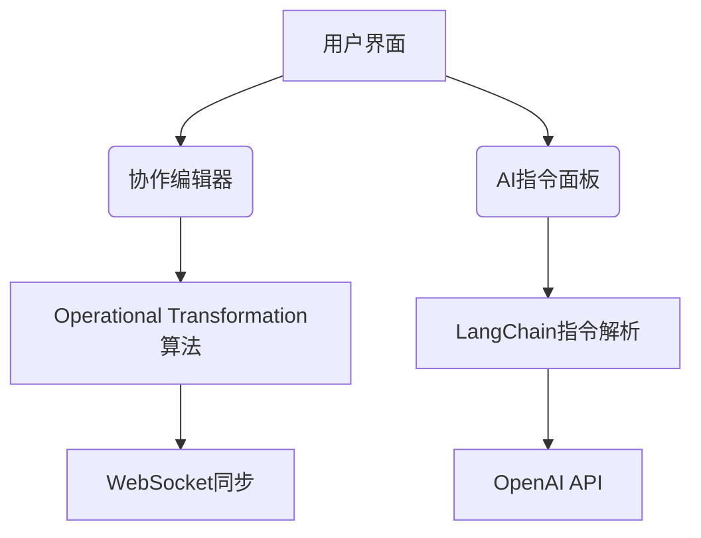
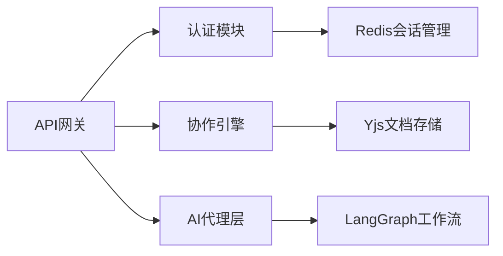

以下是为全栈项目设计的技术文档与任务规划方案，整合了标准化开发流程与AI可解析指令规范，确保Cursor能精准识别任务边界、依赖关系及验收标准。文档基于Vue3+React18+Node.js技术栈，参考了多个研发团队的工程实践。

---

### **一、项目概述**
**项目名称**：全栈智能协作平台
**核心目标**：实现多用户实时协作文档编辑，支持AI辅助内容生成（对标Notion + Cursor）
**技术指标**：
- 实时同步延迟 ≤ 200ms
- 支持100+并发编辑
- 自动保存版本历史（保留30天）
- 文件加载速度 < 1s（10MB内）

---

### **二、技术架构设计**
#### **前端架构（React18 + TS + Vite）**

- **关键技术选型**：
  - 编辑器：Slate.js（富文本框架）+ Yjs（CRDT冲突解决）
  - 状态管理：Zustand（轻量级状态机）
  - AI交互：LangChain.js（指令解析链）
- **性能优化**：
  - 动态加载编辑器组件（React.lazy）
  - Web Worker处理OT算法
  - 增量式AI响应流（SSE）

#### **后端架构（Node.js + Koa + TS）**

- **核心模块**：
  - **认证**：JWT + OAuth2.0（支持GitHub/Google登录）
  - **协作引擎**：Sharedb（OT协议实现） + Redis Pub/Sub
  - **AI代理**：LangGraph编排多模型（GPT-4o→CodeLlama→SVD图像生成）
- **数据库设计**：
  ```sql
  /* MongoDB文档集合 */
  {
    docId: ObjectId, // 文档唯一ID
    content: Buffer, // 压缩后的OT操作流
    versions: [{
      timestamp: ISODate,
      snapshot: String // 版本快照
    }]
  }
  ```

---

### **三、开发规范**
#### **1. 代码规范**
- **前端**：
  - 组件命名：`<EditorSidebar>`（帕斯卡命名法）
  - 状态管理：Zustand store按功能切片（authStore, editorStore）
  - 禁止：任何`any`类型（TS严格模式）
- **后端**：
  - 路由分层：`/api/v1/editor/:docId/operations`
  - 错误码规范：
    - 400：参数错误
    - 409：编辑冲突（返回OT差异补丁）
    - 503：AI服务超时

#### **2. API设计（RESTful）**
| 端点                  | 方法   | 请求体                      | 响应体                     |
|-----------------------|--------|----------------------------|----------------------------|
| `/ai/instructions`    | POST   | `{ prompt: string }`       | `{ taskId: string }`      |
| `/docs/:id/operations`| PATCH  | `{ op: 'insert', pos: 12 }`| `{ revision: 103 }`       |

---

### **四、任务规划（WBS分解）**
#### **甘特图关键路径**
```mermaid
gantt
    title 项目里程碑
    dateFormat  YYYY-MM-DD
    section 核心模块
    认证系统       ：active,  des1, 2025-08-01, 7d
    协作引擎       ：         des2, after des1, 14d
    AI代理层      ：         des3, after des1, 21d
    section 集成测试
    压力测试       ：         des4, after des2, 7d
    上线部署       ：         des5, after des4, 3d
```

#### **Cursor可执行任务指令**
```markdown
<task id="FE-01" type="component" dependsOn="">
  <name>实时编辑器组件</name>
  <input>
    { libs: ["slate", "yjs"], props: { docId: string } }
  </input>
  <output>
    { files: ["src/components/Editor.tsx"], exports: "EditorMain" }
  </output>
  <acceptance>
    1. 输入10KB文本时无渲染卡顿
    2. 协作光标偏移误差 ≤ 5px
  </acceptance>
</task>

<task id="BE-03" type="service" dependsOn="FE-01">
  <name>OT操作存储服务</name>
  <command>
    npx sequelize model:generate --name DocumentOps --attributes content:blob
  </command>
  <validation>
    curl -X PATCH localhost:3000/docs/test01 -d '{ "op": "delete", "pos": 42 }'
  </validation>
</task>
```

---

### **五、部署与运维**
1. **容器化**：
   - 前端：Vite构建 → Dockerfile多阶段构建（最终镜像≤50MB）
   - 后端：Podman部署（带健康检查探针）
2. **监控**：
   - 日志：ELK收集编辑器操作日志
   - 性能：Grafana看板（实时同步延迟、AI响应时长）
3. **灾备**：
   - 文档操作日志持久化到S3（每小时增量备份）
   - AI服务降级方案：超时3s返回"重试"提示

---

### **六、风险控制**
| 风险点                | 应对策略                          | Cursor指令示例                 |
|-----------------------|-----------------------------------|--------------------------------|
| OT算法冲突率上升      | 动态切换CRDT模式                  | `yjs.applyUpdate(doc, update, 'CRDT')` |
| AI生成内容违规       | 接入Moderate API过滤层           | `langchain.addHook('pre-run', moderate)` |
| WebSocket连接不稳定  | 操作本地缓存+差分同步             | `yjs.storeState(localStorage)` |

---

**文档使用指南**：
1. **任务执行**：Cursor解析`<task>`标签内的结构化指令，自动生成代码骨架
2. **进度追踪**：每日运行`npm run report`输出完成度JSON（含阻塞依赖检测）
3. **架构扩展**：新增AI模块需在`ai_agents`目录实现`IAgent`接口

> 本文档通过以下设计确保机器可执行性：
> - 所有组件输入/输出明确定义数据类型
> - 验收条件量化可测量（如延迟、误差值）
> - 依赖关系显式声明（`dependsOn`）
> - 关键操作提供验证命令