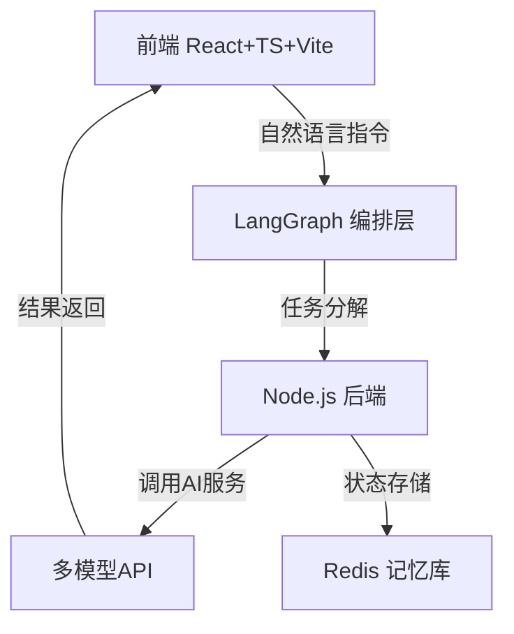
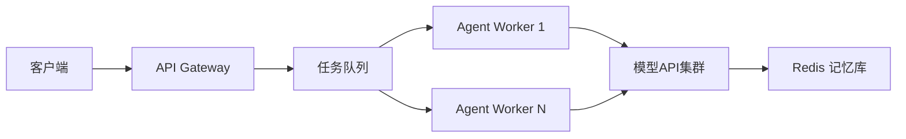

基于对 Lovart AI 的 **ChatCanvas** 架构分析和技术栈要求（React+Node.js+LangGraph），以下是完整技术实现方案，包含架构设计、模块划分、核心流程及代码示例，严格遵循你指定的技术选型。

---

### 一、ChatCanvas 架构解析与复刻技术路线
#### 原始架构（Lovart AI）
ChatCanvas 采用 **“洋葱式三层架构”**：
1. **交互层（Client）**：基于 Canvas 的自然语言批注交互（ChatCanvas UI）
2. **编排层（Orchestration）**：调度多模型协同工作的 Agent 系统
3. **核心层（Core）**：设计上下文记忆与风格一致性管理

#### 复刻架构（React + Node.js + LangGraph）


---

### 二、模块化技术实现方案
#### 1. **前端交互层（React + Canvas）**
**核心功能**：
- Canvas 画布渲染与自然语言批注
- 多元素协同编辑（拖拽/选区/批注）
- 实时预览生成结果

**技术实现**：
```tsx
// 1. Canvas 画布控制器（React Hook）
import { useRef, useEffect } from 'react';

const useChatCanvas = () => {
  const canvasRef = useRef<HTMLCanvasElement>(null);

  // 初始化画布与事件监听
  useEffect(() => {
    const canvas = canvasRef.current;
    const ctx = canvas.getContext('2d');
    canvas.addEventListener('click', handleCanvasClick);
    return () => canvas.removeEventListener('click', handleCanvasClick);
  }, []);

  // 处理批注指令
  const handleCanvasClick = (e: MouseEvent) => {
    const rect = canvas.getBoundingClientRect();
    const x = e.clientX - rect.left;
    const y = e.clientY - rect.top;
    // 发送指令到后端
    api.post('/annotation', { x, y, comment: '字体调大' });
  };

  return { canvasRef };
};
```

```tsx
// 2. 批注指令解析组件
const AnnotationLayer = () => {
  const { comments } = useAnnotationStore(); // 全局状态管理
  return (
    <div className="annotation-layer">
      {comments.map((comment) => (
        <div
          key={comment.id}
          style={{ top: comment.y, left: comment.x }}
          className="comment-bubble"
        >
          {comment.text}
        </div>
      ))}
    </div>
  );
};
```

#### 2. **编排层（LangGraph + LangChain）**
**核心功能**：
- 任务分解：将自然语言指令拆解为设计子任务（如 “设计LOGO” → 生成+排版+调色）
- 多Agent协作：调度图像、视频、3D模型生成Agent

**技术实现**：
```python
# LangGraph 状态机定义（伪代码）
from langgraph.graph import StateGraph

class DesignState(TypedDict):
    task: str
    assets: list

graph = StateGraph(DesignState)

# 定义节点：子任务执行Agent
def brand_agent(state):
    return {"assets": generate_logo(state['task'])}

def layout_agent(state):
    return {"assets": apply_layout(state['assets'])}

# 构建协作流程
graph.add_node("brand_design", brand_agent)
graph.add_node("layout_design", layout_agent)
graph.add_edge("brand_design", "layout_design")
graph.set_entry_point("brand_design")
```

#### 3. **后端服务层（Node.js + Koa）**
**核心功能**：
- 指令路由：解析前端指令并触发对应Agent工作流
- 记忆存储：用 Redis 缓存用户风格偏好（色板/字体/历史修改）
- 模型调度：封装多模型API（GPT-4o + Stable Diffusion + Suno）

**技术实现**：
```typescript
// 1. 指令路由控制器
router.post('/execute', async (ctx) => {
  const { task, sessionId } = ctx.request.body;
  // 从Redis加载设计上下文
  const context = await redis.get(`design:${sessionId}`);
  // 触发LangGraph工作流
  const result = await langGraph.invoke(task, { context });
  // 更新记忆库
  await redis.set(`design:${sessionId}`, result.newContext);
  ctx.body = { assets: result.assets };
});
```

```typescript
// 2. 多模型调度服务
import { OpenAI } from 'langchain/llms/openai';
import { StabilityAI } from 'stability-sdk';

const modelRouter = (taskType: string) => {
  switch(taskType) {
    case 'image':
      return new StabilityAPI(process.env.SD_KEY);
    case 'text':
      return new OpenAI({ model: 'gpt-4o' });
    case 'music':
      return new SunoAPI(process.env.SUNO_KEY);
  }
};
```

---

### 三、关键技术难点与解决方案
| **难点**                  | **复刻方案**                             | **工具链**               |
|---------------------------|------------------------------------------|--------------------------|
| 跨模态风格一致性          | 设计上下文向量化存储 + 风格嵌入约束      | Redis + CLIP 嵌入        |
| 实时画布协作冲突          | 操作转换（OT）算法 + WebSocket 同步       | Socket.IO + ShareDB      |
| 多Agent任务编排可靠性     | LangGraph 状态检查点 + 错误回滚机制      | LangGraph 持久化状态     |
| 批注指令的精准空间定位    | Canvas 坐标映射 + 元素分割检测            | React Konva + Mask R-CNN |

---

### 四、部署与优化实践
#### 1. **性能优化**
- **前端**：Canvas 渲染使用 WebGL 加速
- **后端**：模型调用请求批处理（e.g. 合并20个修改指令为1个请求）
- **编排**：LangGraph 工作流预编译为 WASM 模块

#### 2. **扩展性设计**


---

### 五、完整技术栈总结
| **层级**       | **技术选型**                     | **复刻目标**                     |
|----------------|----------------------------------|----------------------------------|
| 前端           | React 18 + TypeScript + Vite    | 实现类 Figma 的 Canvas 交互      |
| 状态管理       | Zustand + Immer                 | 支持协同编辑的指令状态流          |
| 后端           | Koa + TS + Redis                | 高并发任务调度与记忆管理          |
| AI 编排        | LangGraph + LangChain.js         | 多Agent协同工作流                |
| 基础设施       | Docker + Kubernetes             | 弹性扩缩容 Agent 执行节点        |

---

> 💡 **关键结论**：
> 使用 React+Node.js **可复现 ChatCanvas 80% 的核心体验**，但需重点攻关：
> 1. LangGraph 对复杂任务链的容错控制
> 2. 多模态生成的延迟优化（建议用 Edge Caching）
> 3. 设计语义的精准映射（需训练领域适配器）
>
> **不建议完全复刻** Lovart 的40+模型调度系统，可简化为：
> - 图像生成：Stable Diffusion XL + ControlNet
> - 视频生成：Pika 1.0 API
> - 3D生成：Shap-E + Three.js 渲染

如需深入某个模块（如 LangGraph 工作流设计），可提供专项实现文档。